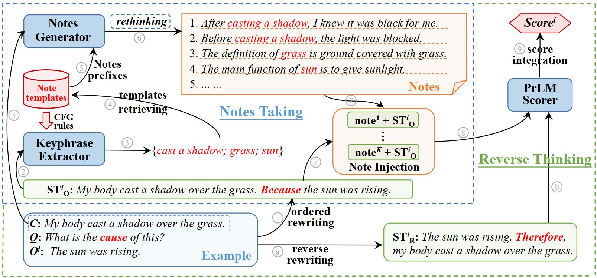

# ArT: All-round Thinker for Unsupervised Commonsense Question Answering [(COLING-2022)](https://arxiv.org/abs/2112.13428)
## Introduction
All-round Thinker (ArT) is a strictly unsupervised model for commonsense question answering, which takes pre-trained language models (PLMs) as knowledge generator and option scorer. It works in a zero-shot way and does not rely on any in/out-of domain labeled data or any model trained on labeled data.


<center><font size=2>Figure 1: Overview of All-round Thinker. The arrow denotes the flowing of data stream, with number/letter within circle marks its order in time.</font></center>

ArT consists of two main modules: *Notes Taking* (within blue dash-box) and *Reverse Thinking* (within green dash-box). The former generates knowledge of high correlation in a general manner, which is independent of specific tasks. The latter takes a bidirectional inference to conduct better causal reasoning. Under a fair comparison, ArT outperforms previous unsupervised models on different tasks and shows better stability on different PLMs.


## Environment
```
numpy==1.19.2
allennlp==2.6.0
nltk==3.5
stanfordcorenlp==3.9.1.1
transformers==4.8.2
torch==1.7.1
tqdm
bert_serving
scikit_learn
tensorboardX
```


## Datasets
We evaluate ArT on three commonsense QA benchmarks: COPA, SocialIQA and SCT (also named as ROCStory).

1. [COPA (Choice of Plausible Alternatives)](https://people.ict.usc.edu/~gordon/copa.html): evaluates the ability of causal reasoning about a certain event, which is described as a single sentence. Each question is accompanied with two candidate options.

2. [ScoialIQA (Scoial Interaction Question Answering)](https://leaderboard.allenai.org/socialiqa/submissions/get-started): evaluates the reasoning ability on social interactions. It has various questions, including the subject's motivation, reaction, personality, etc. Each question is accompanyed with three candidate options. 

3. [SCT (Story Cloze Test)](https://www.cs.rochester.edu/nlp/rocstories): requires models to select the right ending of the given short story from two alternatives. Each story is composed of four sentences.

We pre-process above datasets into```.jsonl``` files, in which each line is an instance. We save these files as: `dev.jsonl` and `test.jsonl` into following path:
```
dataset/copa
dataset/socialiqa
dataset/rocstory
```

## Usage
### 1. Download
Before running ArT, you need to download some required tools and pretrained language models (PLM).

1. Stanford-CoreNLP:
Please download [stanford-corenlp-4.2.2](https://huggingface.co/stanfordnlp/CoreNLP/resolve/main/stanford-corenlp-latest.zip) and save as: `SIFRank/corenlp/stanford-corenlp-4.2.2` .
   
2. ELMo:
   Please download ELMo-Original [weight file](https://s3-us-west-2.amazonaws.com/allennlp/models/elmo/2x4096_512_2048cnn_2xhighway/elmo_2x4096_512_2048cnn_2xhighway_weights.hdf5) and [options file](https://s3-us-west-2.amazonaws.com/allennlp/models/elmo/2x4096_512_2048cnn_2xhighway/elmo_2x4096_512_2048cnn_2xhighway_options.json). Save them at: `SIFRank/elmo`
   
3. OpenAI GPT:
We employ four scales of GPT-2 as our PLM backbone: [DistilGPT-2](https://huggingface.co/distilgpt2/tree/main), [GPT-2-medium](https://huggingface.co/gpt2-medium/tree/main), [GPT-2-large](https://huggingface.co/gpt2-large/tree/main) and [GPT-2-xlarge](https://huggingface.co/gpt2-xl/tree/main). Please save them at: `gpts/`
   
### 2. Run ArT
You can directly test ArT through running the bash scripts in `scripts/` with the parameters provided by us:

To generate notes:
```
gen_copa.sh  # for COPA
gen_socialiqa.sh # for SocialIQA
gen_rocstory.sh # for SCT
```

To score options:
```
test_copa.sh  # for COPA
test_socialiqa.sh # for SocialIQA
test_rocstory.sh # for SCT
```

## Performance
The accuracy (%) of ArT on COPA, SocialIQA and SCT are as follows (The results could be slightly undulating since ArT takes random sampling in knowledge generation):

| Tasks \ PLMs | GPT-2<sub>distil</sub> | GPT-2<sub>medium</sub> | GPT-2<sub>large</sub> | GPT-2<sub>xlarge</sub> |
|:------------:|-----------------------:|-----------------------:|----------------------:|-----------------------:|
|     COPA     |                   61.0 |                   65.6 |                  69.4 |                   69.8 | 
|  SocialIQA   |                   42.0 |                   45.6 |                  47.6 |                   47.3 |
|     SCT      |                   60.2 |                   68.3 |                  69.5 |                   71.6 |


